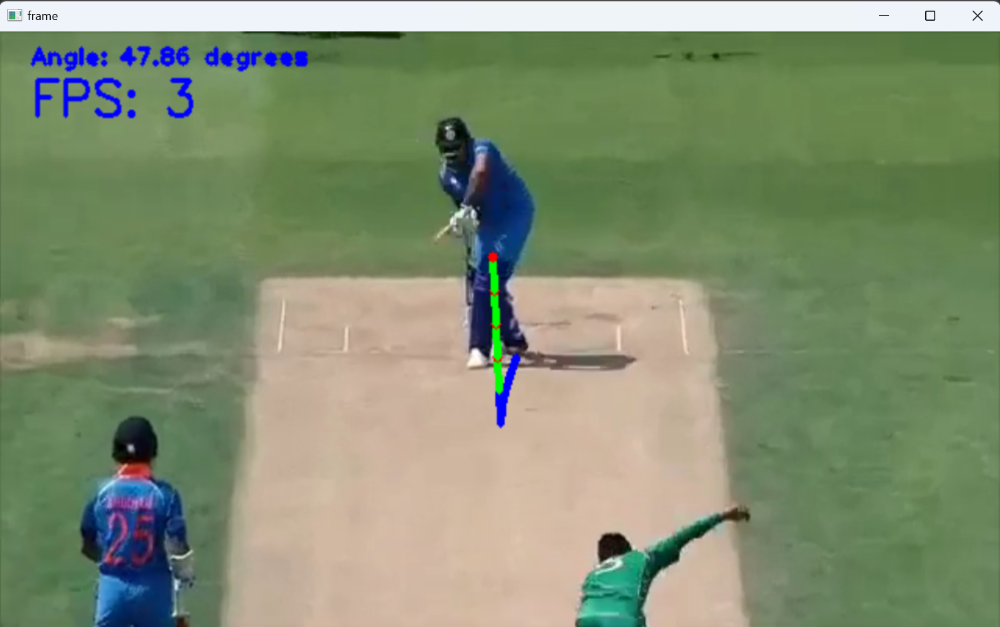

# Cricket Ball Trajectory Prediction🏏
Revolutionizing Cricket Analytics: Predicting Ball Trajectories with Precision and Innovation
## Overview
This project aims to predict the trajectory of a cricket ball in videos using advanced object detection and tracking techniques powered by YOLOv8. The system extracts frames from cricket videos, detects the cricket ball, and predicts its future trajectory, providing detailed insights into its motion.

---

## Features
- **Cricket Ball Detection**: Utilizes YOLOv8 for precise detection of cricket balls in diverse scenarios.
- **Trajectory Prediction**: Predicts the future positions of the ball based on its current trajectory.
- **Angle Calculation**: Calculates the angle of the ball's motion, identifying key events like bounces.
- **Dataset Creation**: Custom dataset with 1778 annotated images created from YouTube videos for robust model training.
- **Real-time Tracking**: Processes live or pre-recorded cricket videos for instant ball tracking.

---

## Directory Structure
```
└── kushagra3204-Cricket-Ball-Trajectory-Prediction/
    ├── runs/
    │   └── detect/          # YOLOv8 training outputs
    ├── youtube_video_image_extractor.py # Extract frames from YouTube videos
    ├── yolov8s.pt           # YOLOv8 small model
    ├── predict.py           # Ball detection and trajectory prediction
    ├── modelSave.py         # Save trained model to ONNX format
    ├── yolov8m.pt           # YOLOv8 medium model
    ├── videos/              # Directory to store test videos
    ├── requirements.txt     # Python dependencies
    ├── yolov8l.pt           # YOLOv8 large model
    ├── ball_tracking_train.py # YOLOv8 training script
    ├── README.md            # Project documentation
    ├── yolov8n.pt           # YOLOv8 nano model
    └── data.yaml            # Dataset configuration for YOLOv8
```

---

## Installation
1. **Clone the Repository**
   ```bash
   git clone https://github.com/kushagra3204/Cricket-Ball-Trajectory-Prediction.git
   cd Cricket-Ball-Trajectory-Prediction
   ```

2. **Install Dependencies**
   ```bash
   pip install -r requirements.txt
   ```

3. **Download Pre-trained Models**
   Place the YOLOv8 models (`yolov8n.pt`, `yolov8s.pt`, etc.) in the project directory.

---

## Usage
### Extract Frames from Videos
Use `youtube_video_image_extractor.py` to extract frames from a YouTube video:
```bash
python youtube_video_image_extractor.py
```
### Train the Model
Train the YOLOv8 model with the custom dataset:
```bash
python ball_tracking_train.py
```

### Run Ball Detection and Prediction
Detect the ball and predict its trajectory:
```bash
python predict.py
```

### Save Model to ONNX Format
Export the trained model to ONNX:
```bash
python modelSave.py
```

---

## <a href="https://www.kaggle.com/datasets/kushagra3204/cricket-ball-dataset-for-yolo" target="_blank">Dataset</a>
```
https://www.kaggle.com/datasets/kushagra3204/cricket-ball-dataset-for-yolo
```
The dataset includes 1778 annotated images in YOLOv8 format, created by extracting frames from cricket videos using LabelImg.

### Key Features:
- **Diverse Conditions**: Includes images under various lighting and background conditions.
- **Real-world Scenarios**: Captures cricket balls in motion, both in gameplay and practice settings.
- **Multiple Ball States**: Covers new and worn cricket balls for comprehensive detection.

---

## Applications
- **Real-time Cricket Analysis**: Player performance analysis, ball trajectory tracking, and umpiring.
- **Broadcasting Enhancements**: Real-time overlays, highlights, and ball tracking.
- **Automated Summarization**: Key moment extraction for highlight reels.

---

## Images of the Working System
Below are some visual examples showcasing the system in action:



---

## Contributing
We warmly invite researchers, developers, and enthusiasts from around the world to join us in making this project even more impactful. Your unique skills and ideas can help elevate this work to new heights, revolutionizing the field of sports analytics and cricket ball trajectory prediction.

Whether you're contributing code, refining models, expanding datasets, or sharing feedback, your collaboration is invaluable in advancing this mission. Together, we can create a groundbreaking tool that enhances cricket analysis, assists players, and engages fans globally.
